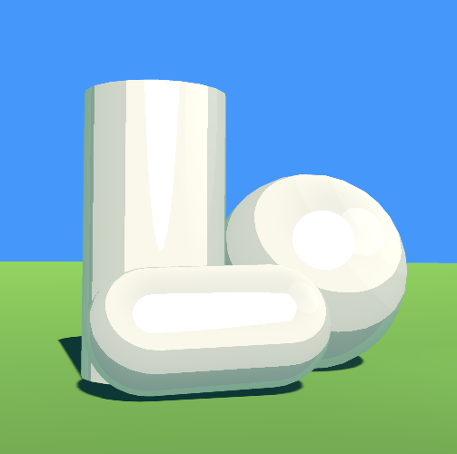

# Cel Shading Shader for Unity

A custom cel-shading shader designed for anime/MMD-style characters in Unity.  
Supports features like hard-edge lighting, SSS (subsurface scattering), rim lighting, double-sided rendering, and more.

## Sample 1

  

> The character model in the preview is **Gawr Gura** from Hololive as implementation on anime-style model.  
> It is **not included** in this repository and is used **only for demonstration purposes**.  
> © Cover Corp – All rights reserved.

## Sample 2

  

> This screenshots included in repository as sample scene

## Features

- Hard and soft cel-shading with custom steps
- Subsurface scattering simulation
- Adjustable rim lighting (can be limited to shadows only)
- Specular highlights with adjustable sharpness
- Alpha cutout support for transparent textures
- Optional double-sided rendering with customizable backface color

## Getting Started

1. **Import the shader** into your Unity project
2. Assign the `YmneShader/CelShading` shader to your material
3. Tweak the properties in the material inspector
4. (Optional) Open the `SampleScenes` folder to explore setup and parameter examples

## Included

- `Shaders/`: Main Cel Shading shader file
- `Materials/`: Example materials using the shader
- `SampleScenes/`: Simple demo scenes with pre-configured lighting & materials

## Shader Parameters

### 🎨 Base Colors

| Property      | Description            | Type      | Default        |
|---------------|------------------------|-----------|----------------|
| `_MainTex`    | Main texture (albedo)  | Texture   | White          |
| `_Color`      | Albedo multiplier      | Color     | (1,1,1,1)      |
| `_UseTexture` | Toggle use of texture  | Toggle    | 1              |
| `_Cutoff`     | Alpha cutoff           | Range 0–1 | 0.5            |

### Shading

| Property             | Description                 | Type       | Default         |
|----------------------|-----------------------------|------------|-----------------|
| `_UseHardEdgeShadow` | Hard-edge shadow toggle     | Toggle     | 1               |
| `_ShadowThreshold`   | Shadow intensity cutoff     | Range 0–1  | 0.5             |
| `_ShadowSteps`       | Shading step count          | Range 1–10 | 3               |
| `_ShadowColor`       | Shadow color                | Color      | (0.3,0.3,0.3,1) |
| `_MinLight`          | Minimum ambient lighting    | Range 0–1  | 0.1             |
| `_SpecularSize`      | Sharpness of specular light | Range 0–1  | 0.1             |
| `_SpecularColor`     | Specular highlight color    | Color      | (1,1,1,1)       |

### Subsurface Scattering (SSS)

| Property             | Description              | Type       | Default         |
|----------------------|--------------------------|------------|-----------------|
| `_UseSSS`            | Enable SSS               | Toggle     | 1               |
| `_SubsurfaceColor`   | Light bleed color        | Color      | (1, 0.5, 0.4, 1) |
| `_SubsurfaceAmount`  | SSS brightness           | Range 0–10 | 1.0             |
| `_SubsurfaceFalloff` | SSS spread               | Range 1–8  | 2.0             |

### Rim Light

| Property            | Description                        | Type       | Default       |
|---------------------|------------------------------------|------------|---------------|
| `_UseRimLight`      | Enable rim light                   | Toggle     | 1             |
| `_RimInShadowsOnly` | Apply rim only in shadows          | Toggle     | 1             |
| `_RimColor`         | Rim light color                    | Color      | (0.8,0.8,1,1) |
| `_RimThreshold`     | Edge detection threshold           | Range 0–1  | 0.7           |
| `_RimIntensity`     | Rim light intensity multiplier     | Range 0–10 | 1.5           |

### Double-Sided Rendering

| Property         | Description             | Type    | Default     |
|------------------|-------------------------|---------|-------------|
| `_DoubleSided`   | Render both sides       | Toggle  | 0           |
| `_BackfaceColor` | Color for backfacing tris | Color | (0.8,0.8,1,1) |

## Screenshot Attribution

> Character that shown in screenshots belong to their respective copyright holders.  
> This repository does **not** include any character models or copyrighted content.  
>  
> Specifically:
> - **Gawr Gura** (© Cover Corp / Hololive) is used **only for showcasing shader visuals**
> - These images are included under **fair use** for non-commercial, educational demonstration

## Compatibility

- ✅ Unity 6 (Built-in Render Pipeline)
- ⚠️ Not compatible with URP or HDRP.
- 💡 Optimized for Forward Rendering, compatible with Deferred

## License

MIT License
Free to use, modify, and distribute.
Attribution is appreciated but not required.
